# Campus Marketplace

A full-stack marketplace where students buy and sell with each other — post an item with a photo
in seconds, browse with search and filters, and check out with a cart that can never sell the
same item twice.

**React 18 SPA · Go REST API · MongoDB · JWT auth · light & dark themes**

<p align="center">
  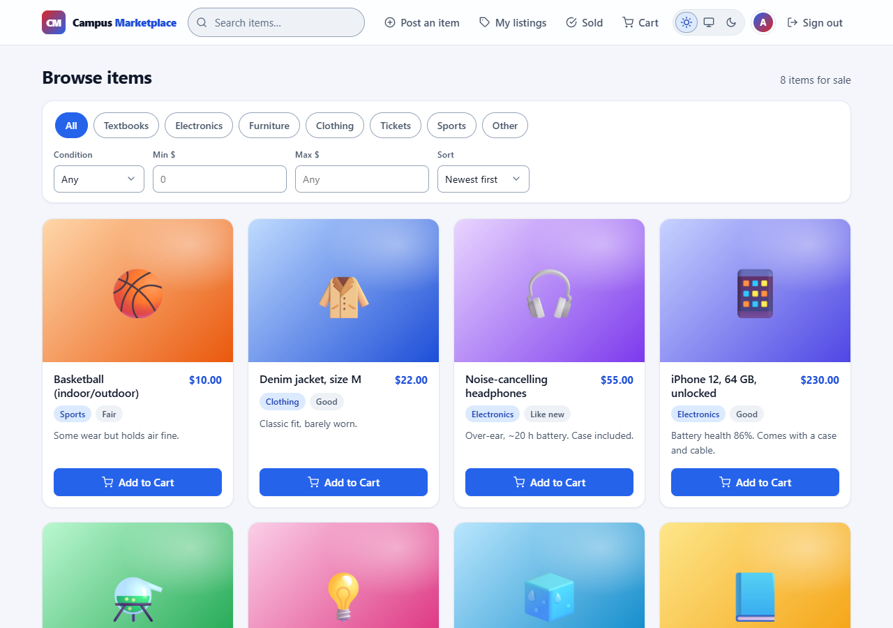
</p>

---

## Screenshots

| | |
|---|---|
| **Browse — dark mode**<br>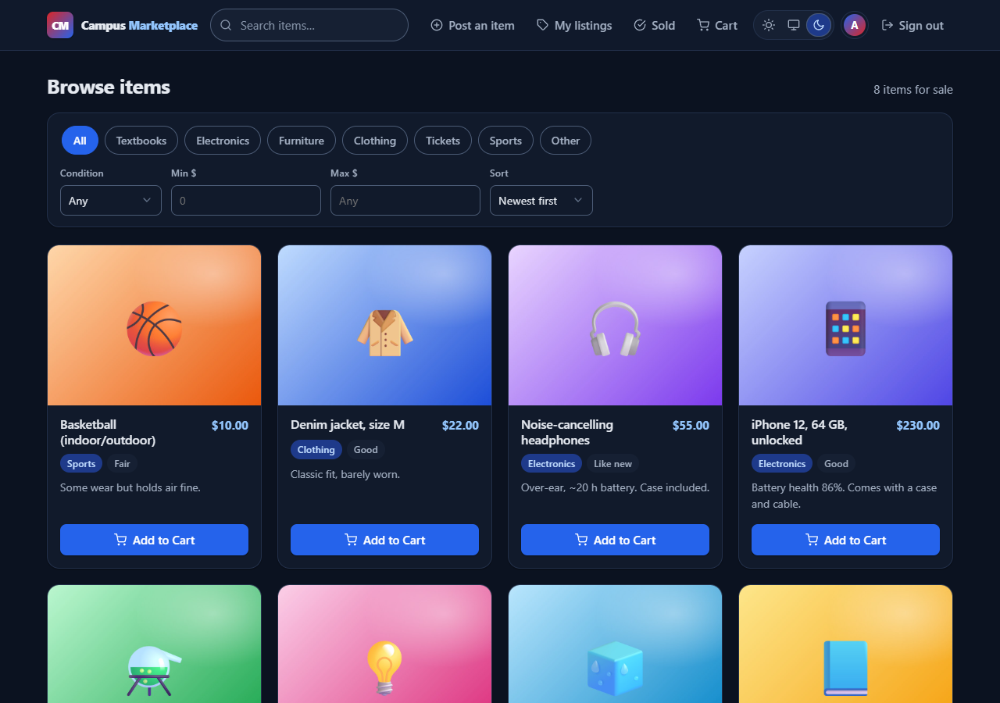 | **Filters live in the URL** (`?category=Textbooks&max_price=50`)<br>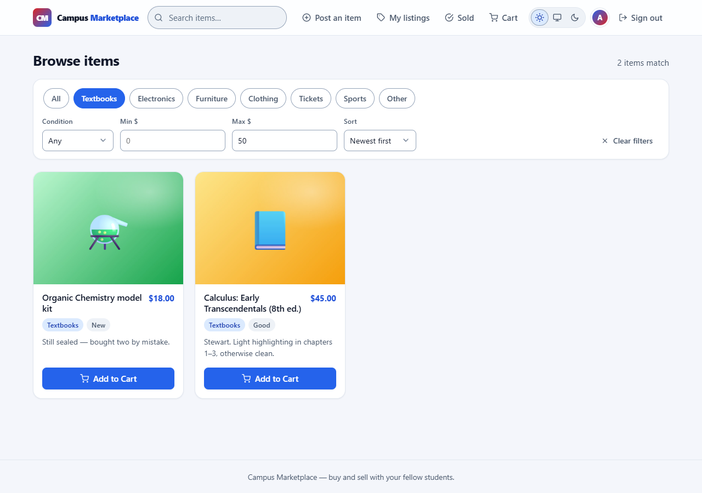 |
| **Post an item** — photo dropzone with live preview<br>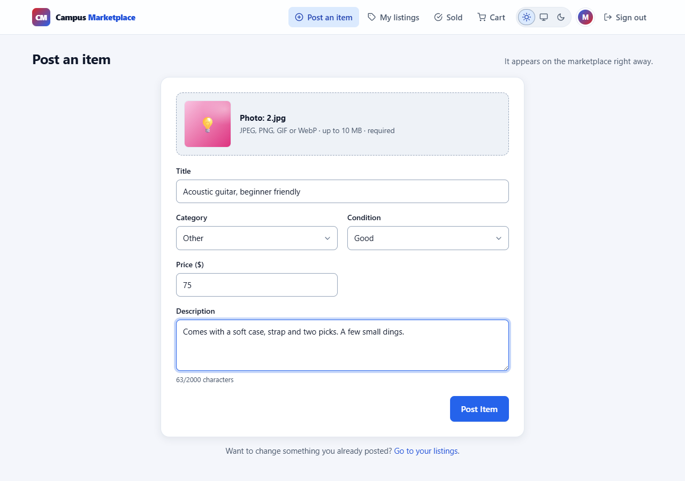 | **Edit dialog** — accessible modal (focus trap, Escape, backdrop)<br>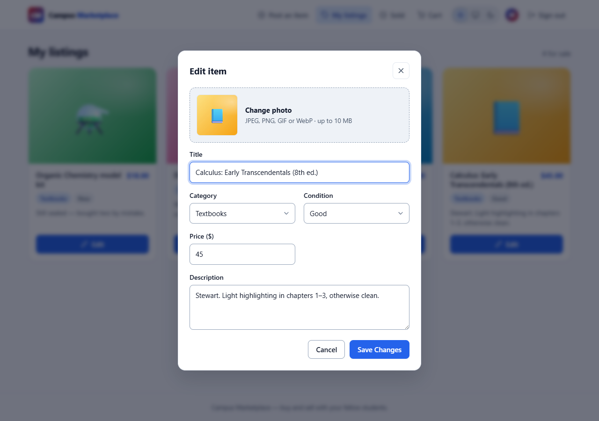 |
| **Cart** — order summary and one-click checkout<br>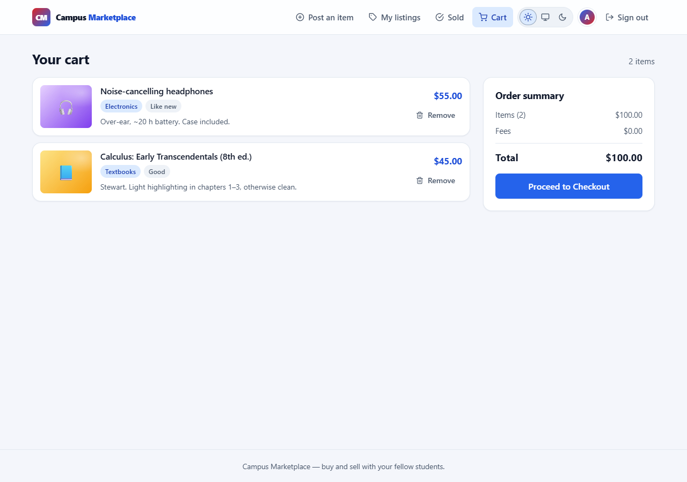 | **Sold** — what your buyers took, and what you earned<br>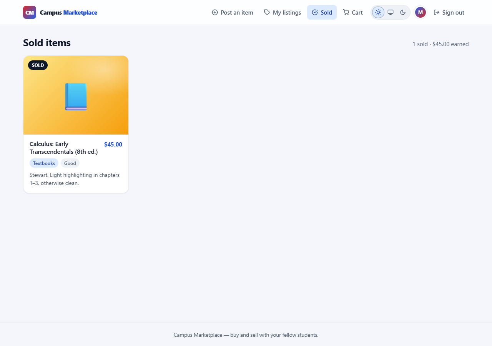 |
| **Sign in** — red-blue brand panel<br>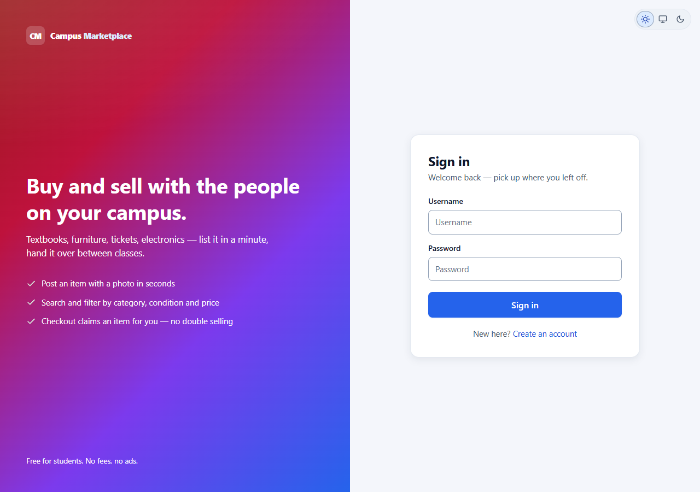 | **Phone** — two-column grid & hamburger menu<br>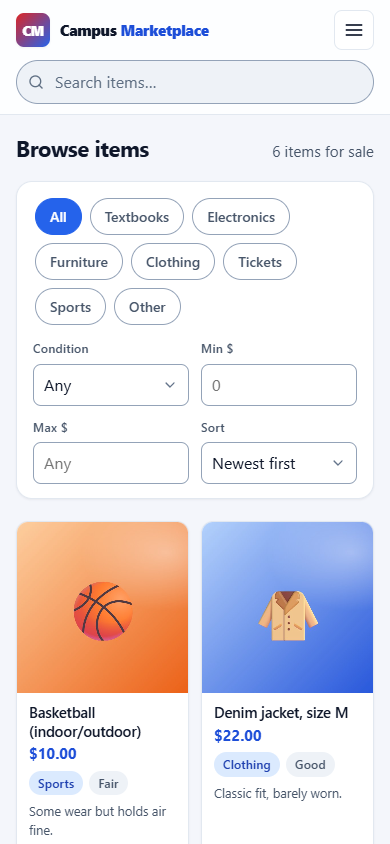 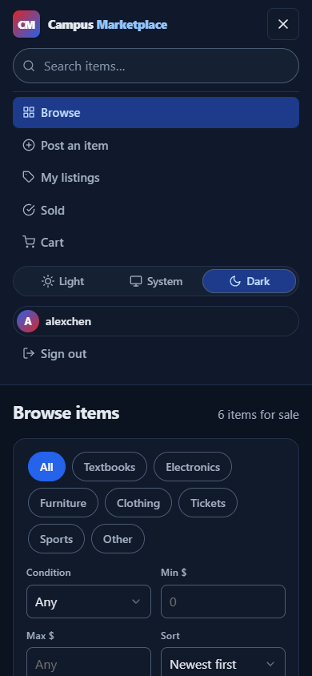 |

---

## Features

- **Accounts** — sign up / sign in with bcrypt-hashed passwords and JWT sessions (7-day tokens)
- **Listings** — post any item with a photo, category and condition; edit your own until it sells
- **Discovery** — server-side search, category / condition / price filters and sorting; every
  filter lives in the URL, so results survive refresh and links can be shared (a shared link even
  survives the sign-in detour)
- **Cart & checkout** — one request buys everything in the cart; each item is claimed atomically,
  so two buyers can never both purchase the same thing, and the receipt says exactly what went
  through
- **Sold page** — see which of your items sold and what you earned
- **UI** — responsive from phone to desktop, Light / Dark / System theme switch (remembered,
  no flash on load), WCAG AA colour contrast, keyboard navigable, skeleton loading, friendly
  empty states — and zero third-party requests (system fonts, no CDNs)

---

## Architecture

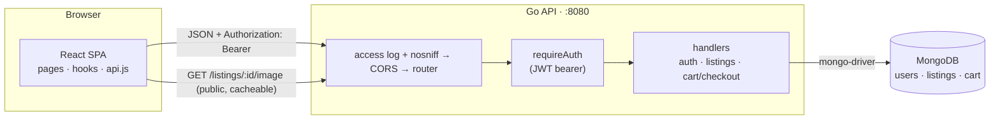

Two deployable pieces and a database:

| Piece | Stack | Responsibility |
|---|---|---|
| **Frontend** (`Campus-MarketPlace/`) | React 18, react-router 6, CRA | All UI. Pages call one module — [`services/api.js`](Campus-MarketPlace/src/services/api.js) — which attaches the token, parses JSON, and turns failures into typed errors. Hooks own client state: `useAuth`, `useListings`, and `useTheme` (exported by `ThemeContext`). |
| **Backend** (`Campus-MarketPlace-go/`) | Go 1.23, gorilla/mux, mongo-driver | All rules. Middleware chain (logging/nosniff → CORS → JWT auth), thin handlers per domain, and a startup step that migrates legacy data and builds indexes. |
| **MongoDB** | standalone, database `bookbay` | Three collections (below). Uniqueness rules are enforced by unique indexes, not application checks, so they hold under concurrency. |

### Data model

| Collection | Fields | Indexes |
|---|---|---|
| `users` | `username`, `password` (bcrypt hash — never serialised), `created_at` | `username` **unique** |
| `listings` | `title`, `price`, `description`, `category`, `condition`, `user_id`, `sold`, `buyer_id?`, `sold_at?`, `created_at`, `updated_at`, `image` (bytes), `image_type` | `(user_id, created_at)`, `(sold, created_at)`, `(sold, category, created_at)` |
| `cart` | `user_id`, `listing_id`, `added_at` | `(user_id, listing_id)` **unique**, `listing_id` |

Listing JSON never contains the photo bytes — clients get an `image_url`
(`/listings/{id}/image?v=<updated_at>`) whose version changes when the photo does, so browsers can
cache it as immutable.

### Request lifecycle

1. **Access log + `X-Content-Type-Options: nosniff`** — the outermost wrapper; every request is
   logged and every response carries the header.
2. **CORS** — preflights are answered here, and only origins in `ALLOWED_ORIGINS` receive the
   `Access-Control-Allow-Origin` header (a browser on any other origin can't read responses).
3. **Router** — explicit method + path; unknown routes get JSON 404s.
4. **`requireAuth`** — everything except `/register`, `/login` and listing photos requires a valid
   `Authorization: Bearer` token; the handler receives the **caller's identity from the token,
   never from the request body**.
5. **Handler** → MongoDB → uniform JSON out (`{"error": "…"}` on failure). On any 401 the
   frontend drops the session and returns to sign-in.

### The checkout, end to end

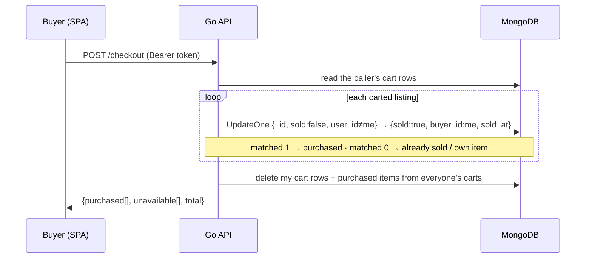

The conditional `UpdateOne` is the whole concurrency story: whichever buyer's update matches
first gets the item; the loser's matches nothing and is told why. No locks, no transactions
needed — which matters because a standalone MongoDB (the default local install) has no
multi-document transactions.

---

## How it was designed

Decisions and the reasoning behind them:

1. **JWT bearer tokens instead of server sessions.** The API stays stateless — any instance can
   serve any request, nothing to store or replicate. Tokens are HS256, 7-day expiry, secret from
   `JWT_SECRET` (min 32 chars; a random one is generated in dev). Trade-off: tokens live in
   `localStorage`, so XSS would expose them — acceptable for this project and called out below.
2. **Identity comes only from the token.** No handler reads a user id from a body or query
   string. Ownership checks (edit your own listing, read your own cart) are `WHERE user_id = me`
   filters in the query itself, so a check can't be forgotten between read and write.
3. **Invariants live in the database.** "One account per username" and "an item is in a cart at
   most once" are unique indexes; "an item sells exactly once" is a conditional update. The app
   *reports* violations, it doesn't have to prevent them.
4. **Photos in MongoDB, served by a dedicated endpoint.** An early version inlined base64 images
   into every listing response — a 50-listing page could weigh 100 MB. Now lists exclude the bytes
   via projection and `` tags hit `/listings/{id}/image`, which serves the real content type
   (upload bytes are sniffed; only JPEG/PNG/GIF/WebP accepted, 10 MB cap) with immutable caching
   and a version-busting URL. For a campus-scale app the 16 MB document limit is plenty; the
   step up, when needed, is object storage with the same URL shape.
5. **Checkout is one server-side request.** The first version looped PUTs from the browser —
   a mid-loop failure could sell item A while telling the user everything failed. Now the server
   owns the loop, detaches from the request context (a closed tab can't half-finish a purchase),
   and returns a per-item report.
6. **The URL is the filter state.** Search text, category, condition, price range and sort are
   query parameters, not component state — refresh keeps them, links share them, back/forward
   work. Text inputs are debounced; a stale response can never overwrite a newer one (requests
   are sequenced); invalid half-typed values are sanitised client-side so the grid never blanks
   on a 400.
7. **Migrations run at startup and are idempotent.** The project renamed its domain (books →
   listings) and its cart schema mid-life; the server upgrades old databases itself — rename
   collection, rename field (after dropping the old unique index that would collide), default new
   fields, dedupe, then build indexes. Every step is safe to re-run.
8. **The UI is one design system.** All colour/spacing/shadow decisions are CSS custom properties
   on `:root`, with a dark set on `:root[data-theme="dark"]`. The theme switch writes that
   attribute (an inline script applies the saved choice before first paint — no flash); "System"
   follows `prefers-color-scheme` live. Every token pair was contrast-checked to WCAG AA in both
   palettes. System fonts and zero external requests keep first paint instant and IPs private.
9. **Abuse resistance proportional to the project.** bcrypt hashes; login can't leak whether a
   username exists (identical message + dummy hash compare); 10 sign-in attempts/min per
   IP+username and 5 sign-ups/min per IP (in-memory); search text is regex-escaped before it
   reaches the database; uploads are validated by content, not extension.
10. **Tested at three levels.** The committed suite is `react-testing-library` over the app
    shell — 12 tests covering auth flows, URL filters, the theme switch, and menu/dialog focus
    behaviour — plus `go vet` static checks on the backend. During development the real stack was
    additionally driven end-to-end with a (not committed) Playwright script — register → post →
    filter → edit → cart → checkout → sold on desktop and phone viewports — and curl-level API
    checks for every status code, including the migration paths against planted legacy data.

---

## Getting started

You need **Node.js 18+**, **Go 1.23+**, and **MongoDB** on `mongodb://localhost:27017`
(the `bookbay` database and its indexes are created automatically).

### 1. Backend

```bash
cd Campus-MarketPlace-go
go run .
```

Listens on http://localhost:8080. Without `JWT_SECRET` it generates a random secret and warns —
fine for development, but every restart signs everyone out.

| Variable          | Default                       | Purpose                                                    |
|-------------------|-------------------------------|------------------------------------------------------------|
| `PORT`            | `8080`                        | Port to listen on                                          |
| `MONGO_URI`       | `mongodb://localhost:27017`   | MongoDB connection string                                  |
| `MONGO_DB`        | `bookbay`                     | Database name                                              |
| `ALLOWED_ORIGINS` | `http://localhost:3000`       | Comma-separated browser origins allowed by CORS (see note) |
| `JWT_SECRET`      | *(random per start)*          | Signs session tokens — **set in prod**, min 32 chars       |

Generate a secret with `openssl rand -hex 32`
(PowerShell: `-join ((1..32) | % { '{0:x2}' -f (Get-Random -Max 256) })`), then:
`JWT_SECRET=<secret> go run .` (bash) or `$env:JWT_SECRET = "<secret>"; go run .` (PowerShell).

**Upgrading from an earlier version?** Just start it against the same database — the startup
migration handles the rest (see design decision 7). If the very old code ever produced two
accounts with the same username, the server stops and tells you to rename or delete one.

### 2. Frontend

```bash
cd Campus-MarketPlace
npm install
npm start
```

Opens http://localhost:3000. To point at a backend elsewhere, copy `.env.example` to `.env` and
set `REACT_APP_API_URL`.

**Origins must match.** Browsers can only *read* responses when their origin is in
`ALLOWED_ORIGINS`. If the frontend runs anywhere other than `http://localhost:3000` (different
port, `127.0.0.1` instead of `localhost`, a deployed host), add that exact origin or every
request in the app fails with "Could not reach the server".

### Tests

```bash
cd Campus-MarketPlace && CI=true npm test   # React tests, one-shot (plain `npm test` = watch mode)
cd Campus-MarketPlace-go && go vet ./...    # backend static checks
```

---

## API reference

All responses are JSON; errors look like `{"error": "human readable message"}`.
🔒 = requires `Authorization: Bearer <token>`.

| Method | Path                    | Auth | Description                                                          |
|--------|-------------------------|------|----------------------------------------------------------------------|
| GET    | `/health`               |      | Liveness + database reachability → `200 {status, database}` or `503`  |
| POST   | `/register`             |      | `{username, password}` → `201 {token, user_id, username}`             |
| POST   | `/login`                |      | `{username, password}` → `200 {token, user_id, username}`             |
| GET    | `/me`                   | 🔒   | Validate the token → `{user_id, username}`                            |
| GET    | `/listings`             | 🔒   | Unsold listings by other users; query parameters below               |
| GET    | `/listings/mine`        | 🔒   | Your listings, sold and unsold                                        |
| POST   | `/listings`             | 🔒   | multipart `title, price, description, category, condition, image` → `201 Listing` |
| PUT    | `/listings/{id}`        | 🔒   | Edit your own unsold listing (`image` optional) → `200 Listing`      |
| GET    | `/listings/{id}/image`  |      | The listing photo (real `Content-Type`, immutable-cacheable)          |
| GET    | `/cart`                 | 🔒   | Listings in your cart that are still available                        |
| POST   | `/cart`                 | 🔒   | `{listing_id}` → `201`; `400` own item, `409` sold or already in cart |
| DELETE | `/cart/{listingId}`     | 🔒   | Remove one item                                                       |
| POST   | `/checkout`             | 🔒   | Buy everything in the cart → `{purchased, unavailable, total}`        |

`GET /listings` query parameters (all optional, combinable; invalid values → `400`):

| Parameter   | Values                                        | Notes                                          |
|-------------|-----------------------------------------------|------------------------------------------------|
| `q`         | free text, ≤ 100 chars                        | case-insensitive match on title or description |
| `category`  | `Textbooks` `Electronics` `Furniture` `Clothing` `Tickets` `Sports` `Other` | |
| `condition` | `New` `Like new` `Good` `Fair`                |                                                |
| `min_price` / `max_price` | number, 0 – 1,000,000           | `max` must not be below `min`                  |
| `sort`      | `newest` (default) `price_asc` `price_desc`   |                                                |

A `Listing` is `{id, title, price, description, category, condition, user_id, sold, buyer_id?,
sold_at?, created_at, updated_at, image_url}`.

Server-enforced rules: usernames 3–32 chars of letters/digits/`._-`; passwords ≥ 8 chars
(≤ 72 bytes, bcrypt's limit); titles ≤ 120 and descriptions ≤ 2000 chars; uploads must be real
JPEG/PNG/GIF/WebP ≤ 10 MB; you can only edit your own listings; you can't cart or buy your own
listing; an item sells exactly once.

---

## Security notes

- Passwords are bcrypt hashes; login failures never reveal whether a username exists.
- Sessions are JWTs in `localStorage` — standard for a project like this, but any XSS would
  expose the token: keep dependencies updated and never render untrusted HTML.
- Every data-changing endpoint derives the acting user from the token, never the request.
- Sign-in is throttled (10/min per IP+username), sign-up too (5/min per IP) — in memory, so use
  a shared store if you run several instances.
- Photos are only ever served with an `image/*` content type; all responses carry
  `X-Content-Type-Options: nosniff`; search text is escaped before becoming a database regex.
- Set a strong `JWT_SECRET` and restrict `ALLOWED_ORIGINS` before exposing the server. `.env`
  files are git-ignored.

---

## Project structure

```
campus-marketplace/
├── docs/
│   ├── DEPLOY.md              # step-by-step hosting guide
│   └── screenshots/           # the images in this README
├── Campus-MarketPlace/        # React frontend
│   └── src/
│       ├── components/        # Header, Layout, AuthLayout, ListingCard, FilterBar,
│       │                      # EditListingForm (modal), ThemeToggle, StatusMessage,
│       │                      # EmptyState, ListingGridSkeleton
│       ├── pages/             # HomePage, CartPage, NewListingPage, MyListingsPage,
│       │                      # SoldItemsPage, SignInPage, SignUpPage
│       ├── hooks/             # useAuth, useListings, useDebouncedValue
│       ├── context/           # AuthContext, ThemeContext
│       ├── constants/         # listingOptions.js — categories, conditions, sort orders
│       ├── utils/             # afterAuthPath
│       ├── services/api.js    # every backend call, token handling
│       ├── styles/App.css     # the whole design system (tokens, light + dark)
│       ├── App.js             # router + providers (the app shell)
│       └── App.test.js        # the 12 frontend tests
└── Campus-MarketPlace-go/     # Go backend
    ├── Dockerfile             # static build for container hosts
    ├── fly.toml               # Fly.io deployment config
    ├── main.go                # server, CORS, graceful shutdown
    ├── config.go              # environment variables
    ├── router.go              # endpoints
    ├── auth.go                # JWT, bcrypt, throttling, requireAuth middleware
    ├── handlers_auth.go       # /register /login /me
    ├── handlers_listings.go   # listings, search/filter, photos
    ├── handlers_cart.go       # cart + checkout
    ├── database.go            # connection, legacy-data migration, indexes
    ├── models.go              # User, Listing, CartItem, categories & conditions
    └── respond.go             # JSON helpers, access log, nosniff
```

## Deploying

The repo ships with everything the hosting platforms need — a Dockerfile for the API, a Fly.io
config with health checks and idle sleep, and SPA rewrite rules for Vercel/Netlify.

**[docs/DEPLOY.md](docs/DEPLOY.md)** walks through it end to end: MongoDB Atlas → Go API on
Fly.io (or Render) → React frontend on Vercel (or Netlify), including the CORS step that
connects them. All three tiers are free.

## Roadmap

Multiple photos per listing and a listing detail page · buyer ↔ seller messaging · buyer
purchase history · CI.

## Notes

- The database is still named `bookbay` for backwards compatibility; set `MONGO_DB` to change it.
- The screenshots use seeded demo data; product images are generated placeholders.
